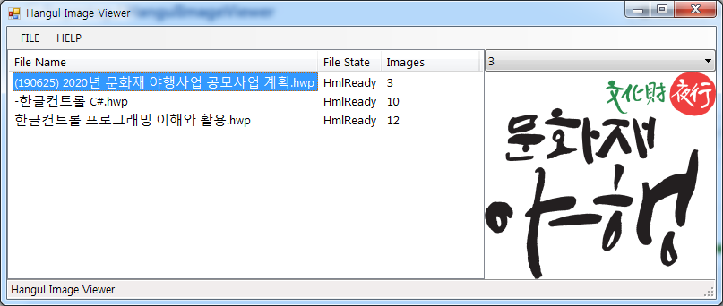

# HangulImageViewer
Shows the images that included in HWP (Hancom Office Hangul) file.
한컴오피스 한/글 파일(HWP)에 포함된 이미지를 보여줍니다.

  

  - 한컴오피스 2018 (한/글 2018) 및 HwpCtrl 10.0 환경에서 개발/시험되었습니다.

 # Todo
   - 종료할 때 발생하는 Crash 해결 (HwpCtrl 관련 문제?)
   - ~~일부 이미지가 시현되지 않는 현상 수정~~
   - 포함된 이미지의 크기(용량)을 줄여주는 기능 추가
